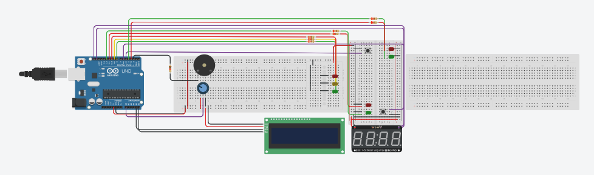

# **Pelican Crossing System**
Proyek ini mengimplementasikan sistem lampu lalu lintas penyeberangan untuk pejalan kaki yang simulasikan dengan menggunakan mikrokontroler arduino. Sistem ini dapat menyesuaikan waktu tunggu kendaraan berdasarkan tingkat kepadatan lalu lintas dan memungkinkan pejalan kaki menambah waktu penyeberangan dalam kondisi darurat. 

## Fitur
* **Adaptive Traffic Delay** : Waktu tunggu kendaraan yang berubah secara dinamis
* **Extendable Crossing Time** : Pejalan kaki bisa menambah durasi menyeberang jika tombol ditekan kembali pada saat sistem aktif
* **Safety Blink** : Lampu hijau pejalan kaki akan berkedip saat waktu akan habis sebagai sinyal peringatan

## Teknologi yang Digunakan
* **Bahasa Pemrograman** : C++
* **Website Simulasi** : Tinkercad
* **Konsep Pemrograman** : Manipulasi I/O, Tipe Data, Perulangan, Percabangan, Konstanta/Preprocessor Directive, Fungsi, dan Operator Logika

## Library yang Digunakan
* Wire.h
* LiquidCrystal_I2C
* Adafruit_GFX
* Adafruit_LEDBackpack

## Cara Simulasi
1. **Kondisi Awal** : Lampu lalu lintas hijau dan lampu pejalan kaki merah. LCD menampilkan "Lalu Lintas Aktif"
2. **Request Menyeberang** : Tekan salah satu tombol dan sistem akan mengecek potensiometer
   * Jika kondisi **SEPI**, maka waktu tunggu dalam rentang 0--20
   * Jika kondisi **NORMAL**, maka waktu tunggu dalam rentang 8--25
   * Jika kondisi **RAMAI**, maka waktu tunggu 16--40
   * Jika kondisi **PADAT**, maka waktu tunggu dalam rentang 23--60
3. **Menyeberang** : Lampu pejalan kaki hijau menyala dan buzzer berbunyi
4. **Tambah Waktu** : Jika masih menyeberang dan waktu hampir habis, tekan tombol lagi untuk reset waktu ke 20 detik
5. **Peringatan** : 5 detik terakhir, lampu akan berkedip dan suara buzzer akan menjadi lebih cepat 

## Bahan yang Dibutuhkan
* Arduino Uno 
* LCD I2C 
* Breadboard 
* Resistor 
* Switch Button
* 7-Segment Clock Display
* Buzzer
* Potensiometer
* Lampu LED (Merah, Kuning, dan Hijau)
* Kabel Jumper

## Gambar


## Cara Menjalankan 
(Secara Simulasi)
1. Masuk ke website simulasi arduino (Tinkercad) melalui link di bawah ini
   ```bash
   https://www.tinkercad.com/things/93rbM1mFaQx-pelican-crossing?sharecode=HiI4_iwmOlUSGQEwdspbMLhGoY2LptzCs-eRRPZdYcM
2. Jalankan program

